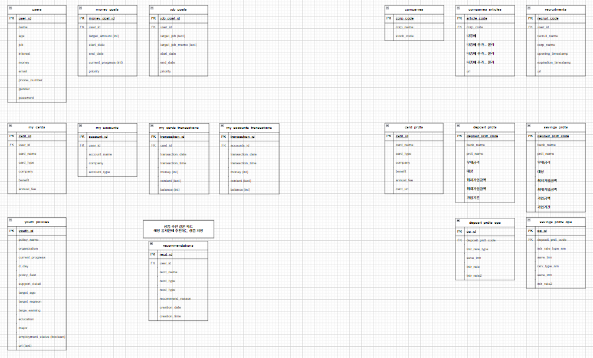
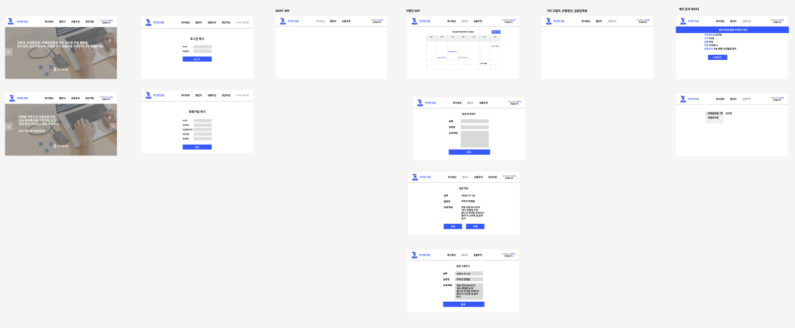

# [작전명 청춘] 청년을 위한 맞춤 정보 플랫폼

### 프로젝트 개요
- 삼성 청년 SW아카데미(SSAFY) 12기 관통프로젝트
- 기간 : 2024-11-18 ~ 2024-11-27
-  2인 제작, 기능별로 담당을 나누어 데이터 전처리부터 백과 프론트 및 CSS 모두 경험

### 프로젝트의 목표
- "청년"이라는 큰 틀 아래에서 취업준비생, 이직준비생, 직장인에게 도움이 되는 웹사이트 개설.
- 취업준비생 및 이직준비인을 위한 채용공고, 직장인을 위한 거래내역에 따른 예적금 상품추천, 금융 뉴스 및 시장 정보를 확인할 수 있다.

### 기술 스택 및 사용 데이터
- Back-end
    - Python 3.9.13
    - Django
    - Flask
    - sqLite3
    - RESTful API
- Front-end
    - Vue3
    - BootStrap
    - HTML5
    - CSS
- Data
    - 사람인 API : 채용정보
    - 온통청년 API : 청년 지원 정책 정보
    - 금융감독원 API : 예금 적금 정보
    - 유튜브 API : 금융 관련 영상 렌더링

### 프로젝트 진행 과정
1. 기획
    - 영화와 금융 중 여러가지 주제를 두고 "취준생을 위한 웹페이지"에서 포괄적으로 "청년을 위한 웹"으로 빌드업
    - 주제 선정 및 구체화

2. 기술 스택 선정
    - 어떤 기능을 구현하기 위하여 어떠한 기술을 사용해야 하는지 선정
    - 데이터 수집할 API 선정 및 기능 구현을 위한 기술 스택 선정

3. ERD 작성 및 페이지 간 상호작용
    - 데이터를 관리하기 위한 ERD 그리고 필드 설정
    - 만들어낼 페이지를 구체적으로 선정한 다음 페이지 간 상호작용 확정

4. 데이터베이스 완성
    - 기술 스택 및 ERD를 바탕으로 데이터 크롤링 및 API에서 데이터 가져온 다음 전처리, 데이터베이스에 저장

5. 작업 단위별로 나누어서 각자 프론트와 백을 모두 진행
    - 데이터 가공, 백엔드 설정, 프론트엔드와 연결, CSS작업을 모두 해봄으로서 풀스택 개발자가 되기 위한 자질을 함양

### 작업물 시각화
- ERD

- Figma

## 협업 작업시 기억할 점
- 작업 시작하기 전 꼭 pull받고 시작하기
- 가상환경 켜졌는지 반드시 확인하기
- makemigrations migrate한 다음 꼭 loaddata 진행하기
- 하나의 작업이 끝나면 페어에게 push한다고 반드시 알리기

## 참고
- 1121 Vcalendar 기능 구현
    - `npm install v-calendar`
    - `https://vcalendar.io/getting-started/installation.html`